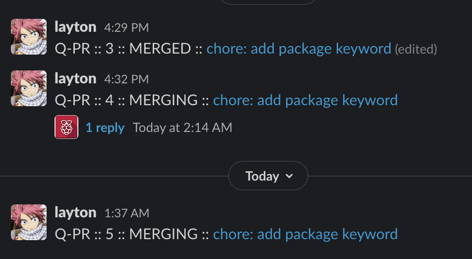
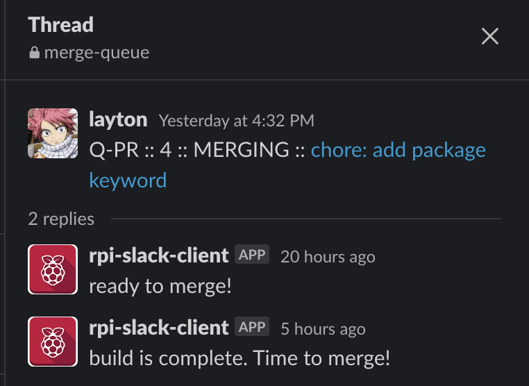

# slack-merge-queue

handles a merge queue with github actions and slack.

## Setup

### Step 1: Create or use slack web api bot

Create a slack api bot. If one exists for your organization then retrieve the Oauth token.

### Step 2: Create github secret

create a github secret with name `SLACK_TOKEN` and its value the Oauth token for your slack bot.

### Step 3: Add build configs

Add the action to your workflow. ensure the modes are used correctly as explained in the `Modes` section.

## Modes

There are various modes to achieve the different actions to manage the queue. These are:

### INIT

This mode is responsible for adding a pull request to the slack queue. You can do this by commenting on a pull request with the `init_trigger` (default: `/merging`). For this mode to work, ensure this piece of your workflow is merged to the main branch of your repository.

sample:

```yaml
name: sample-add-to-q

on:
  issue_comment:
    types: [created, edited]

jobs:
  add_to_queue:
    env:
      SLACK_TOKEN: ${{ secrets.SLACK_TOKEN }}
    runs-on: ubuntu-latest
    name: Add PR to queue
    steps:
      - name: Add PR to queue
        uses: lwhiteley/slack-merge-queue@{version}
        id: add_to_q
        with:
          mode: 'INIT'
          init_trigger: '/merging'
          channel: 'merge-queue'
      # Use the output from the `add_to_q` step
      - name: Get the output
        run: echo "status => ${{ steps.add_to_q.outputs.status }}"
```

### MERGE

This mode updates the slack message of the current pull request. This will change the `Queue Status` from `MERGING` to either `CANCELLED` or `MERGED`. It will also send a message to alert the next Pull request in the queue when the current pull request is closed/merged.

sample:

```yaml
name: sample_update_queue

on:
  pull_request:
    types: [closed]

jobs:
  update_q_on_close:
    env:
      SLACK_TOKEN: ${{ secrets.SLACK_TOKEN }}
    runs-on: ubuntu-latest
    name: Update Queue
    steps:
      - name: Update queue
        uses: lwhiteley/slack-merge-queue@{version}
        id: update_q_on_close
        with:
          mode: 'MERGE'
          channel: 'merge-queue'
          merge_ready_message: 'Last PR closed. This PR is now up for merge!'
      # Use the output from the `update_q_on_close` step
      - name: Get the output status
        run: echo "status => ${{ steps.update_q_on_close.outputs.status }}"
      - name: Get the next PR number
        run: echo "status => ${{ steps.update_q_on_close.outputs.next_pr }}"
```

### ALERT

This mode alerts the current pull request in the queue by adding a message to its thread. Typically this can be used to alert the thread when the build is complete but can be used at any point in the build process based on your use case. If used to alert when the build is complete, ensure the proper dependencies are set to ensure the job is run last or close to last as a post build step.

```yaml
name: sample_alert_current

on:
  pull_request:
    types: [opened, synchronize]

jobs:
  alert_current_pr:
    env:
      SLACK_TOKEN: ${{ secrets.SLACK_TOKEN }}
    runs-on: ubuntu-latest
    name: Alert Current in Queue
    steps:
      - name: Alert queue
        uses: lwhiteley/slack-merge-queue@{version}
        id: alert
        with:
          mode: 'ALERT'
          channel: 'merge-queue'
          alert_message: 'build is complete. Time to merge!'
      # Use the output from the `alert` step
      - name: Get the output status
        run: echo "status => ${{ steps.alert.outputs.status }}"
```

## API Documentation

### Queue Tag

The queue tag is sent by the `INIT` mode.

Pattern: `[Search Prefix] :: [PR number] :: [Queue Status] :: [PR link]`

eg.

`Q-PR :: 3 :: MERGED :: chore: add package keyword`

| Section       | Description                                                                                                                                                      |
| ------------- | ---------------------------------------------------------------------------------------------------------------------------------------------------------------- |
| Search Prefix | Critical piece used to search for queue tags within the channel. It is important that non-queue messages within the channel do not contain the sub string `Q-PR` |
| PR number     | The pull request number                                                                                                                                          |
| Queue Status  | The status of the pull request in the queue. <br/><br/> **enum**: `MERGING`, `CANCELLED`, `MERGED`                                                               |
| PR link       | A link to the pull request page. The text for the link is the pull request title                                                                                 |

### Action Inputs

| Input               | Modes  | Description                                                                                                                               |
| ------------------- | ------ | ----------------------------------------------------------------------------------------------------------------------------------------- |
| mode                | \_\_\_ | Required input to tell the GH Action what mode to run. An invalid mode will fail the build. <br/><br/> **enum**: `INIT`, `MERGE`, `ALERT` |
| channel             | _ALL_  | The slack channel to use as the merge queue <br/> **default:** `merge-queue`                                                              |
| init_trigger        | INIT   | The trigger text for adding a PR to the merge queue. <br/> **default:** `/merging`                                                        |
| merge_ready_message | MERGE  | Message to be sent to the next PR in the queue <br/> **default:** `Last PR closed. This PR is now up for merge!`                          |
| alert_message       | ALERT  | Message to be sent to the current PR in the queue <br/> **default:** `build is complete. Time to merge!`                                  |

### Action Outputs

#### next_pr

this is the `PR number` for the next pull request in the queue. This is only exported by the `MERGE` mode.

#### status

The status of the build run to give an insight into what has happened. These can be useful for taking additional actions in a workflow

| Status            | Modes        | Description                                                                                  |
| ----------------- | ------------ | -------------------------------------------------------------------------------------------- |
| ALREADY_CLOSED    | INIT         | exported when the trigger is used but the pull request is already in a closed state.         |
| TRIGGER_NOT_FOUND | INIT         | exported if a pull request comment does not contain the desired trigger                      |
| ALREADY_QUEUED    | INIT         | exported when a PR is already added to the slack queue                                       |
| ADDED_TO_QUEUE    | INIT         | exported when the pull request has been added to the slack queue                             |
| NOT_FOUND         | ALERT, MERGE | exported when a queue tag is not found in slack                                              |
| COMPLETED         | ALERT        | exported when an unspecific action is complete. one such action is the generic alert action. |
| CANCELLED         | MERGE        | exported when the build tag status has been updated to cancelled                             |
| MERGED            | MERGE        | exported when the build tag status has been updated to merged                                |
| FAILED            | _ALL_        | When any failure occurs then this status will be set for all modes                           |

## Samples






### Tips:

- To watch a thread in slack, manually make a comment in the message thread. you will then be alerted when events are posted to the queue item. For eg. just add a "Watching" comment to the thread of the queue item

### Todos

- [ ] conditionally/lazily map github user to slack user for simpler notification

## Notes

- pull requests are welcome!

## License

Apache 2.0
